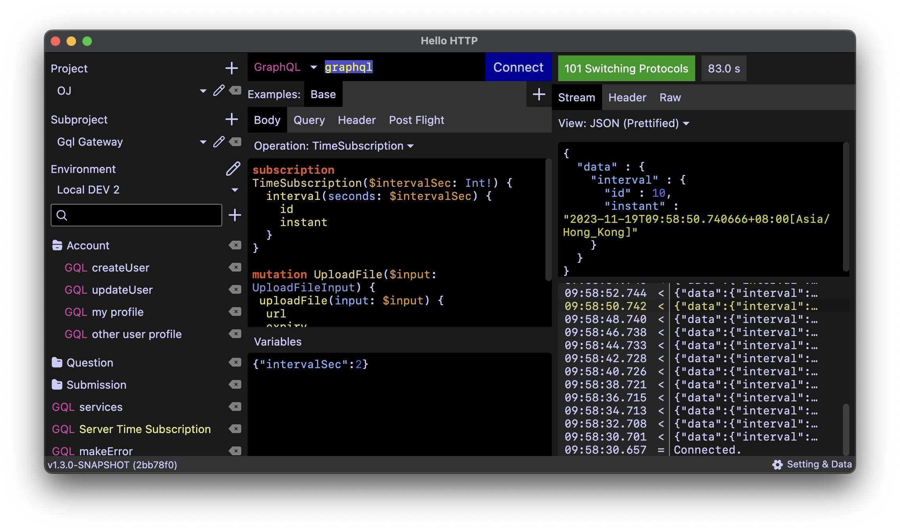
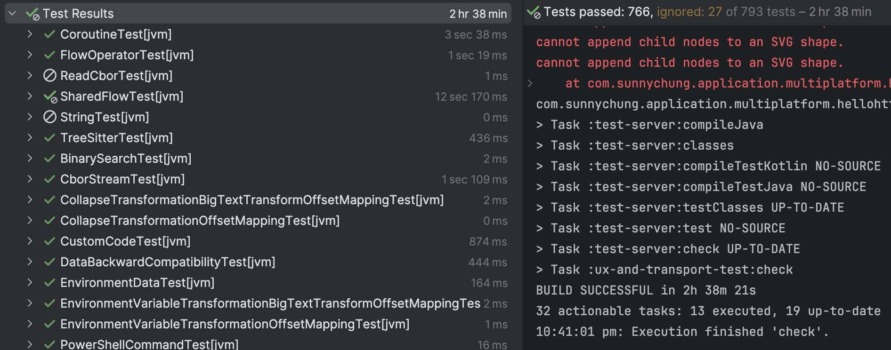

# Hello HTTP

[](LICENSE)
[](https://github.com/sunny-chung/hello-http/releases)
[](https://sunny-chung.github.io/hello-http/)
[](https://github.com/sunny-chung/hello-http/actions/workflows/run-test.yaml?query=branch%3Amain)

This is a cross-platform [portable](https://en.wikipedia.org/wiki/Portable_application) HTTP client desktop application for testing HTTP and REST APIs, WebSocket, GraphQL (including
subscriptions) and gRPC endpoints. This is an alternative to Postman, Insomnia REST, etc.




This software was made because of the decision these software made to go cloud and some of their imperfects. Only you own your data. There is no plan to go cloud.

Though this was built to address my daily needs, hope this could also help solving many of your problems!

## Status

- **macOS** - Stable since v1.2.0
- **Windows** - Stable since v1.4.1
- **Linux** - Stable since v1.4.3

[Filing bug reports](https://github.com/sunny-chung/hello-http/issues), creating feature requests or [throwing ideas](https://github.com/sunny-chung/hello-http/discussions) are much appreciated. I would be glad to hear what users think and want.

Rest assured that the software is regularly tested. Below full test result was snapshot from a pre-release build of v1.7.0. Individual test results can be examined on [GitHub](https://github.com/sunny-chung/hello-http/actions/workflows/run-test.yaml).


## Features

Watch the images and videos on the [website](https://sunny-chung.github.io/hello-http/).

## Executables are not signed by verified developers

Yes. I have no budget to obtain a developer license to sign the application. There are some ways to launch unverified
applications for each OS.
If you are concerned about security, you may grab the source code and build an executable on your own, or
make a sponsorship if you admire Hello HTTP.

To build an executable, grab the code, make sure there is a JDK 17+ and git installed, and run:
```shell
./gradlew createDistributable packageDistributionForCurrentOS
```

The build will be available at `$projectDir/build/compose/binaries/main/app`.

## Persistence

All data are saved in a single content root directory. In Hello HTTP, open setting, scroll down and click
"Open Backup Directory", then go to one level upper. This is the content root directory.

Clearing this directory would reset the application.

## Performance

In regular usage, it demands about 0.5 GB memory. It performs very well on a Windows laptop with 8 GB RAM without a noticeable performance degrade of other applications.

It is also capable of loading large content without slowing down user interactions, although that would consume a significant amount of memory.

## Planned

Following features are on the TODO list (not in order). Feel free to raise feature requests or
express your desired priorities in the issue tracker.

- Binary response view
- Binary request editor
- Overriding default headers
- Checking for version updates
- Establish release builds (minified and without debug logs and symbols)

## Development

Hello HTTP heavily relies on [Jetpack Compose Multiplatform](https://www.jetbrains.com/lp/compose-multiplatform/).
There are quite a number of components built from scratch. Please file a request if you would like them to become a
reusable library.

This project can be edited by any code editor that supports Kotlin 1.9, though IntelliJ IDEA is recommended.

I am also seeking for an experienced UI/UX designer to improve this project.
